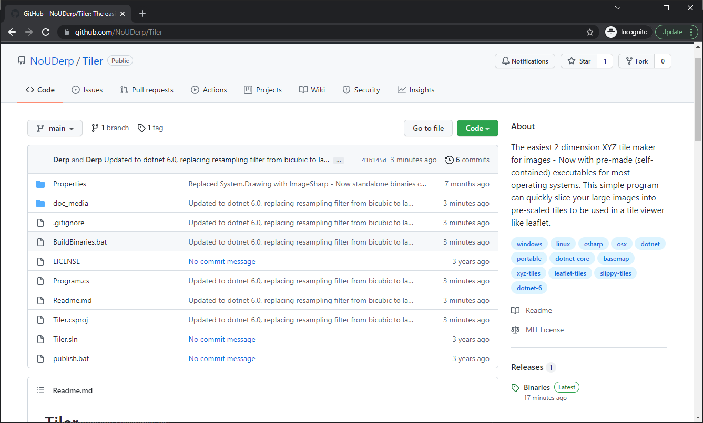
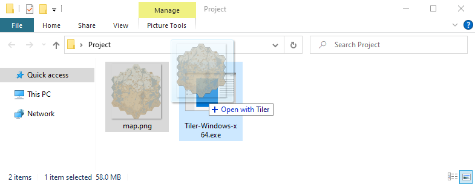

Tiler
=====

## XYZ Tile creator

Tiler is an XYZ tile creator written in C# (dotnet 6.0) that works on Windows, Linux, OSX.
It can quickly process large images into XYZ tiles that can be used with leaflet/slippy/etc.

A transparent background is used to center the image into a square frame and subdivided for any output format that supports transparency. Consider pre-sizing your input image to a square size (to your preferred alignment) if you do not want your image centered. If you wish to use a different (unsupported) output format or naming convention create your own script to resave the format and name. The default naming format is *{z}\_{x}\_{y}.png*.

Tile size defaults to 256 pixels squared (matching the default of leaflet and slippy). 2<sup>*n*</sup> tiles squared are created for each zoom depth *n*.

Compiled binary (portable) versions are available in the **binaries/** directory for **Windows (x86, x64)**, **OS X (x64)**, and **Linux (x64, arm, arm64, musl-x64)**

## Simple use:

* clone or download the repository


* open the binaries directory, find the matching binary/architecture for your OS, drag-and-drop your image onto the appropriate executable file


* your tiles will be created in a new folder in the directory with the original image


## Command line use:

This usage of Tiler requires only the file name for the command line arguments - This style looks different so it can handle drag-and-drop in an explorer context
```
Tiler.exe <input image file>
```
**or explicit option overrides can be set**
```
Tiler.exe -input <input image file> [-size <tile pixel size>] [-zoom <max zoom level>] [-filename "output/{z}_{x}_{y}.png"]
```
* -zoom determines maximum zoom level/layers; if blank it will determine the correct maximum level
* -size determines the tile size in pixels, defaults to 256 (square)
* -output specifies an output directory, absolute or relative - do not include trailing slash

*if no input is specified, the standard input stream is used to load an image*

derp